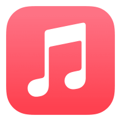
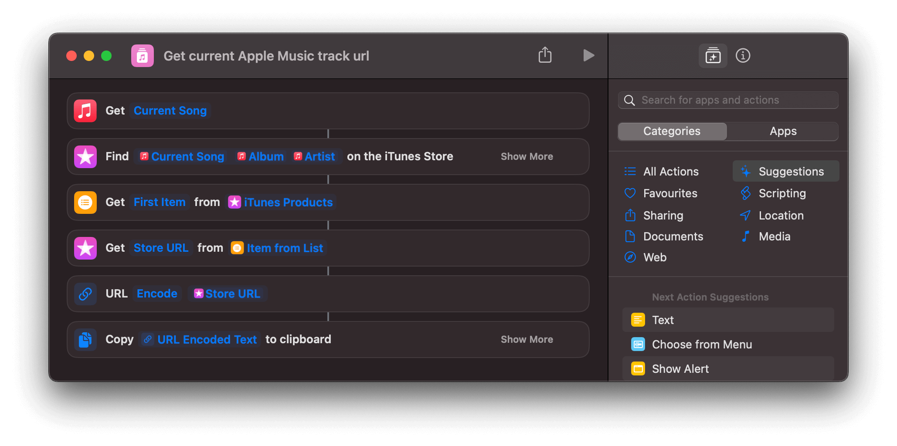
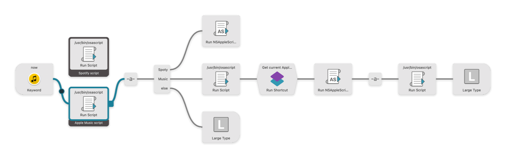
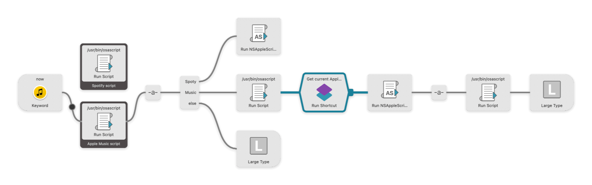

# NowPlaying for Alfred


This AppleScript workflow detects if a song is being played on Apple Music or Spotify, then extracts the names of both the artist and the song, composes a string using a template and copies it to your clipboard.

## Template

This is the template used to compose the final string. ~~The URL will only appear if the song is played on Spotify~~.

```text
♬ <SONG_NAME> - <ARTIST_NAME>  → <URL> 

#Spotify|AppleMusic #NowPlaying
```

### Samples

```text
♬ Future World - Helloween → https://music.apple.com/es/album/future-world/1144728708?i=1144728856&uo=4

#AppleMusic #NowPlaying 
 ```

 ```text
 ♬ Royals - Lorde → http://open.spotify.com/track/4zztp85oS36ijgAWwyhX8p 
 
 #Spotify #NowPlaying
 ```

## Works With installed Applications


  

> 👉 Apps must be installed; the workflow is not compatible with their web version.

## 😱 Dependencies


To obtain the Apple Music URL, I haven't found any other way than using an Apple shortcut that achieves the magic and copies the link to the clipboard. **You can download it from [this iCloud link](https://www.icloud.com/shortcuts/651f3e461698422da240c7d1c217688b)**.



> 🤦‍♂️ Apple Music doesn't always find the current track link because, you know, it's Apple.

---

## Installation

1. Download the [linked shortcut](https://www.icloud.com/shortcuts/f61aa9526e344714b7f0581146e2a8bc) and add it to your shortcuts library.
2. Download [the .alfredworkflow file](./dist/Nowplaying%20for%20Alfred.alfredworkflow) or get it from the **dist/** folder, double click it, and add it to your workflows.
3. Link the appropriate script based on whether you are using Spotify or Apple Music.  
4. Check that the new shortcut is properly linked in the workflow, and that's it. You are good to go!  


## Run it

1. Play some of your stuff on Apple Music or Spotify.
2. Launch Alfred, type `now`, hit enter and as soon as you see the Done! alert, the composed string should be in your clipboard ;)
3. Enjoy!